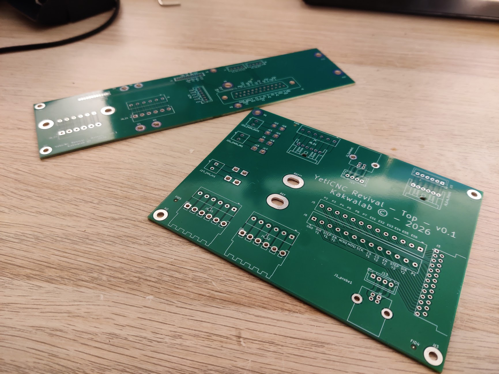
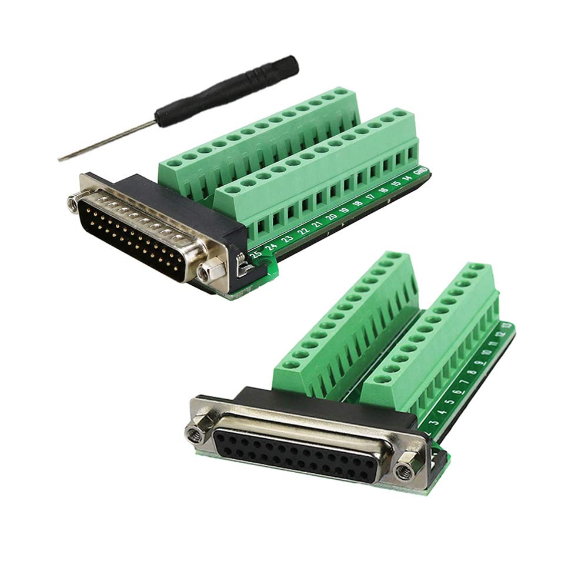
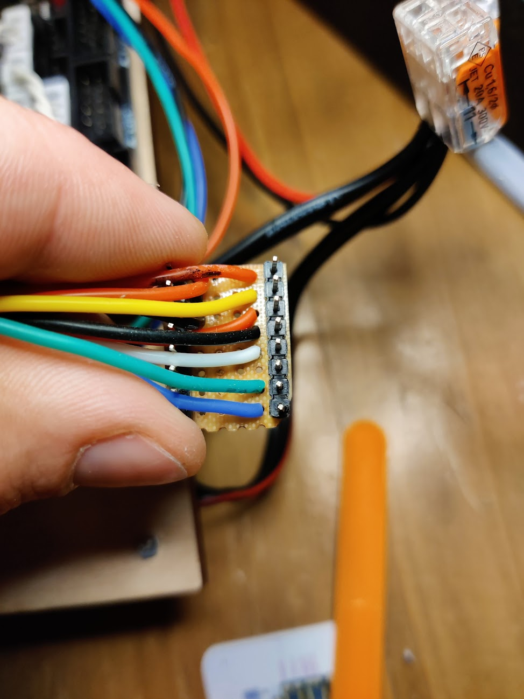
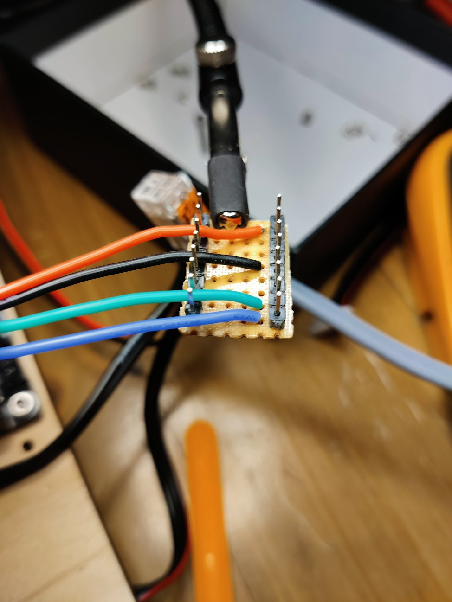
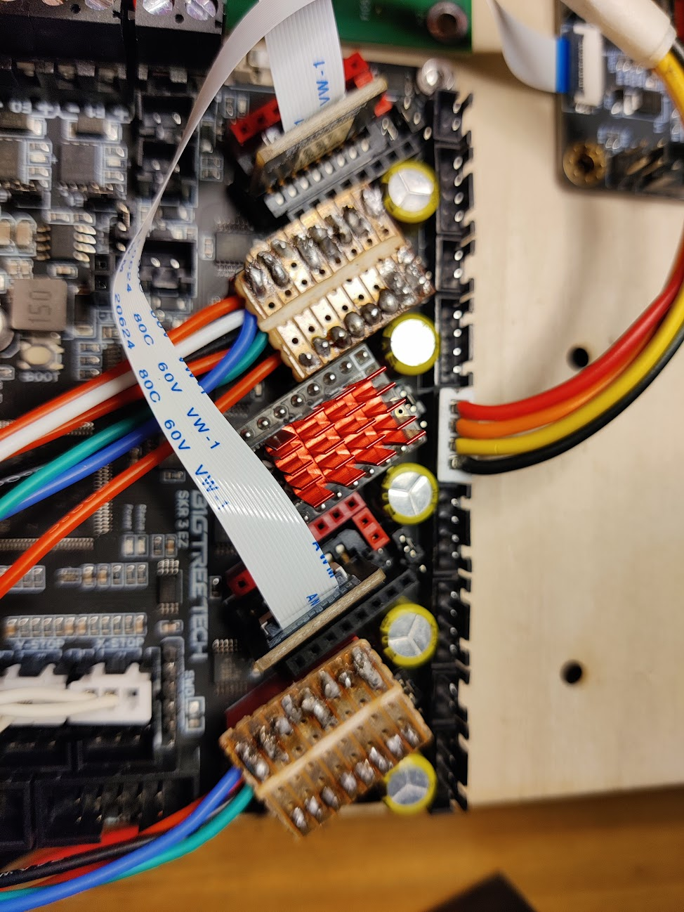
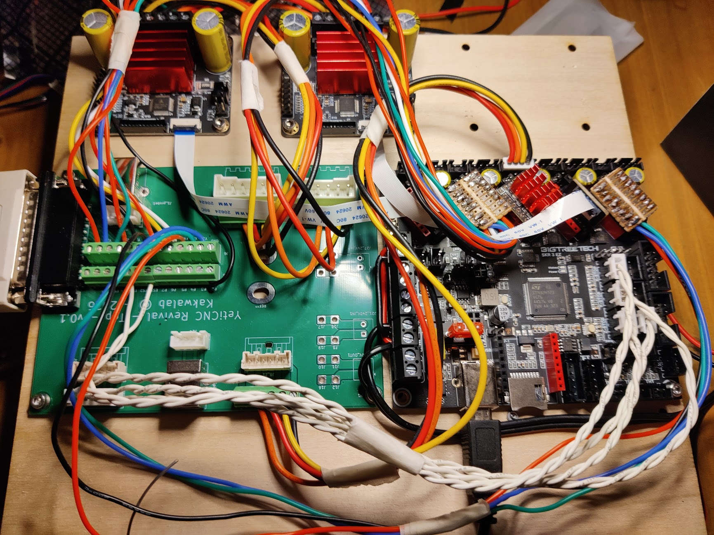
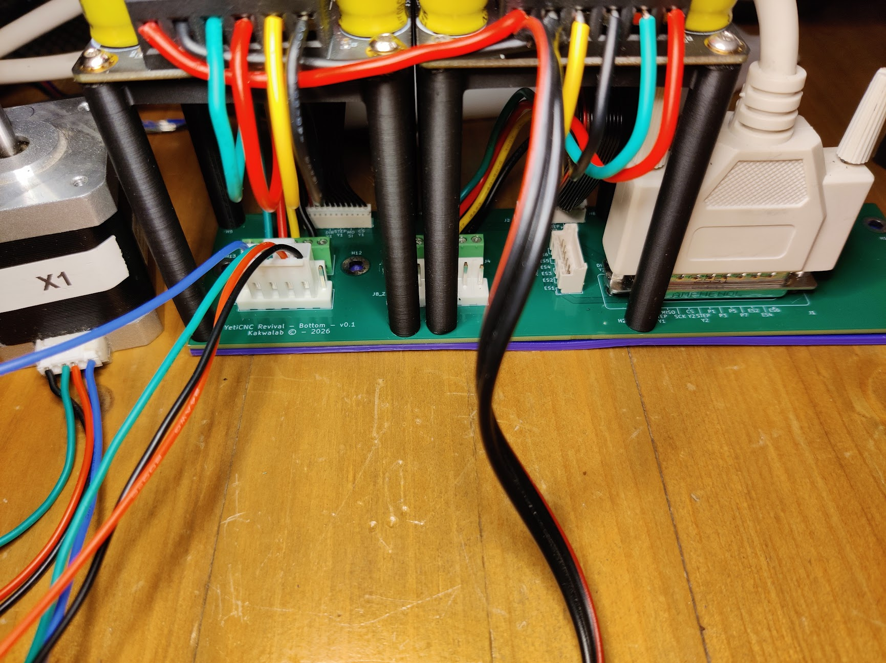

# BTT SKR 3 Wiring Guide for grblHAL

## Hardware Overview

- **Board:** [BTT SKR 3 EZ](https://github.com/bigtreetech/SKR-3) (STM32H723VG)
- **Drivers:** [TMC5160T Plus](https://global.bttwiki.com/TMC5160TPlus.html) and/or [TMC5160T Pro](https://global.bttwiki.com/TMC5160T%20Pro%20V1.0.html)
- **Axes:** X (ganged), Y (ganged), Z
- **Total Motors:** 5 (X, X2 on E0, Y, Y2 on E1, Z)

---

## Stepper Controller Allocation

* X          -> X1
* Y          -> Y1
* Z          -> Z
* Extruder 0 -> X2 (ganged)
* Extruder 1 -> Y2 (ganged)

## Limit Switches <-> port mapping

| Name                   | GRBLHAL   | Pin  | Board label |
|------------------------|-----------|------|-------------|
| Z Limit Switch         | GPIOC 0   | PC0  | Z- STOP     |
| Z Probe                | GPIOC 13  | PC13 | Probe       |
| Y Limit Switch         | GPIOC 3   | PC3  | Y- STOP     |
| Y Limit Max Switch     | GPIOX X   | PXX  | TODO        |
| X Limit Switch         | GPIOC 1   | PC1  | X- STOP     |
| X Limit Max Switch     | GPIOX X   | PXX  | TODO        |
| Collision Switch/ESTOP | GPIOA 7   | PA7  | EXP2 pin 5  |

## Breakout Boards

The SmartBench design forces more or less to split the electronic in two: one part on the top/toolhead, the other bellow the spoilboard,
with the twos requiring some wire harness to communicate and transmit power.

The original harness was actually split in two chains: 
* 4 conductors for 24V+230V for powering stuff.
* 13 conductors for the logic and endstops stuff (the loom with the VGA connector).

This split-up is good: it avoids possible interferences from the power wires.
But the logic side did not have enough conductors (13) for my setup (3 end stops + 2 SPI TMC drivers connection).
In truth, I even doubt it had enough conductors for the original electronics. The step/dir/enable pins of the two bottom/Y TMC drivers were shared and
the SPI stuff not wired, which seems a bit iffy.

So, after pondering the different options (CAN bus, VGA, RJ45 cables, all drivers on top), I decided to replace the logic loom with a DB25 cable.
This connector and cable has enough pins, is common enough, and should be easy to replace if needed.

Also, as a requirement, I wanted my setup to be fully reversible with the original electronics. So, no cutting and clamping endstops and motor cables.

For all these reasons, I've designed two dumb breakout PCBs using KiCad:

* [Bottom breakout PCB](../pcbs/breakout_bottom_dsub25/)
* [Top breakout PCB](../pcbs/breakout_top_dsub25/)

The end results looks like that:

The role of these boards is to interconnect the bottom and top components (via the DB25 cable), and act as adapters between the existing wiring/connectors and what the SKR3 and the TMC5160 drivers expect.
They were also a good opportunity for me to learn KiCad.

But if you are willing to cut some cables, manufacturing these PCBs is not necessary - a pair of DB25 breakout boards with screw terminals can also work:

## Stepper Motors & Drivers

Each TMC5160 driver requires at least the following signals routed from the SKR3:

* `STEP`, `DIR`, `EN` — motion control
* `CS` — SPI chip-select (one per driver)
* Shared SPI bus: `MOSI`, `MISO`, `SCK`
* `24V`, `GND` — shared power rails

So to connect the Y drivers at the bottom to the SKR 3 board, we need two adapters thinggies like that:

With almost everything connected, things look a bit unwildy:

The bottom is a bit more manageable:

## Limit Switches, Probe, and Safeties

TODO (schema)

## Spindle

Not handled currently — the spindle runs at fixed speed and is started manually before the job.
